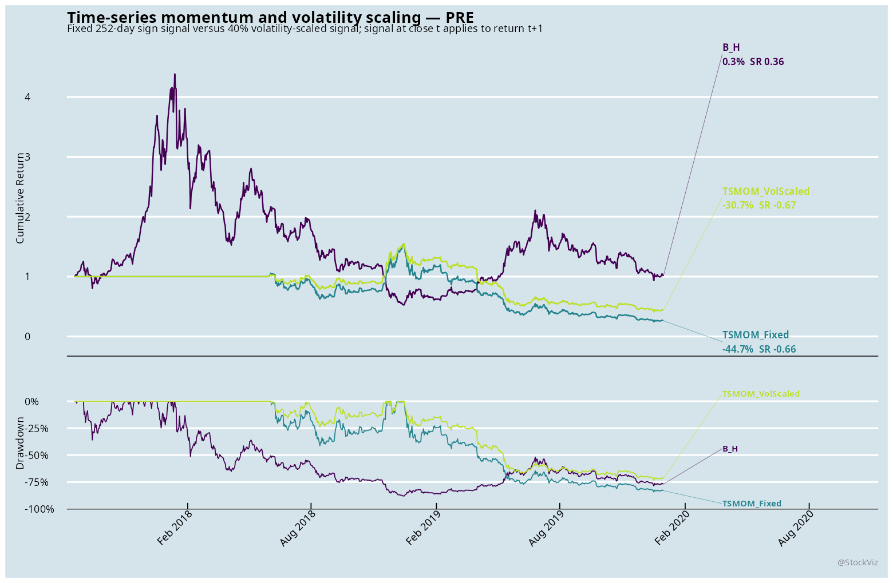
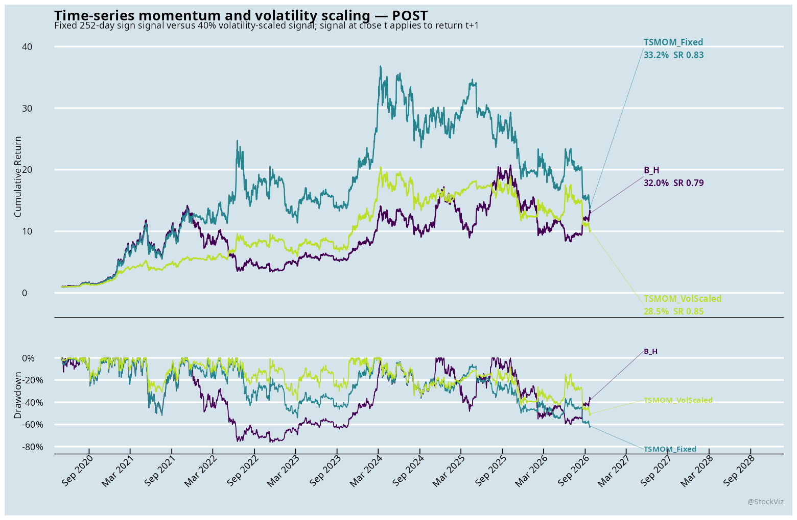
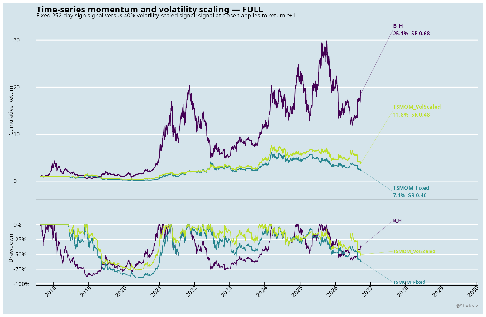

# Time-series momentum and volatility scaling

Status: executed exploratory adaptation.

## Paper mapping

The source paper is Moskowitz, Ooi, and Pedersen (2012), `Time Series Momentum`. The literal signal is the sign of the prior 12-month return, applied to the next holding period. This implementation uses a 252-observed-day signal, monthly close decisions, a one-trading-day causal lag, and a 40% annualized volatility target for the scaled arm.

This report covers: Crypto: BTCUSDT + ETHUSDT UTC dailyized.
The India arm combines NIFTY total-return indices with MCX contracts. MCX returns are contract-safe within each held expiry; the roll-boundary return is set to zero rather than crossing contracts. The US arm uses ETF proxies because the current US database does not provide the paper's original multi-asset futures panel. The crypto arm dailyizes validated BTCUSDT and ETHUSDT hourly bars into complete UTC days.

## Data audit
- Asset class: Crypto: BTCUSDT + ETHUSDT UTC dailyized
- Dates: 2017-08-18 to 2026-09-25; 3297 dates; 2 assets.
- Missing price cells: 0; zero-return cells: 0.
- Fixed-signal turnover: 20.00 average-exposure units; volatility-scaled turnover: 27.88.

## Causality and costs

The target exposure is computed from information through the month-end close and shifted one trading day before it earns returns. Costs are charged on average absolute exposure changes: 25 bps for India, 10 bps for US ETFs, and 5 bps for crypto. The 40% target is capped at 3x exposure. No parameter was selected on the named post period.

## Results

The benchmark is equal-weight buy-and-hold across the same available asset panel. The fixed arm uses the paper's sign signal without volatility scaling. The scaled arm targets 40% annualized volatility and is capped at 3x exposure.

### PRE

| System | N | CAGR | Vol | Sharpe | MaxDD |
|---|---:|---:|---:|---:|---:|
| B_H | 851 | 0.3% | 69.7% | 0.36 | 88.0% |
| TSMOM_Fixed | 569 | -44.7% | 61.2% | -0.66 | 84.3% |
| TSMOM_VolScaled | 569 | -30.7% | 41.7% | -0.67 | 73.4% |

### POST

| System | N | CAGR | Vol | Sharpe | MaxDD |
|---|---:|---:|---:|---:|---:|
| B_H | 2328 | 32.0% | 52.3% | 0.79 | 76.1% |
| TSMOM_Fixed | 2328 | 33.2% | 49.0% | 0.83 | 62.8% |
| TSMOM_VolScaled | 2328 | 28.5% | 38.5% | 0.85 | 51.9% |

### FULL

| System | N | CAGR | Vol | Sharpe | MaxDD |
|---|---:|---:|---:|---:|---:|
| B_H | 3296 | 25.1% | 58.6% | 0.68 | 88.0% |
| TSMOM_Fixed | 3014 | 7.4% | 52.8% | 0.40 | 90.0% |
| TSMOM_VolScaled | 3014 | 11.8% | 39.8% | 0.48 | 76.6% |

In each window, read the volatility-scaled arm together with its drawdown and turnover. A higher CAGR or Sharpe is not sufficient if it comes from materially higher leverage or a worse drawdown.

## Limitations

- The India MCX arm omits roll P&L at the contract boundary; its reported returns are deliberately conservative and are not a substitute for a fully marked roll adjustment.
- The US arm is an ETF adaptation, not a futures replication.
- The crypto arm is a daily adaptation of hourly data and is not directly comparable to the original futures sample.
- The paper's CFTC-position analysis is not reproduced because the required point-in-time positioning data is not in this estate.
- This is a first-pass mechanism test, not a deployable strategy or a literal replication.
