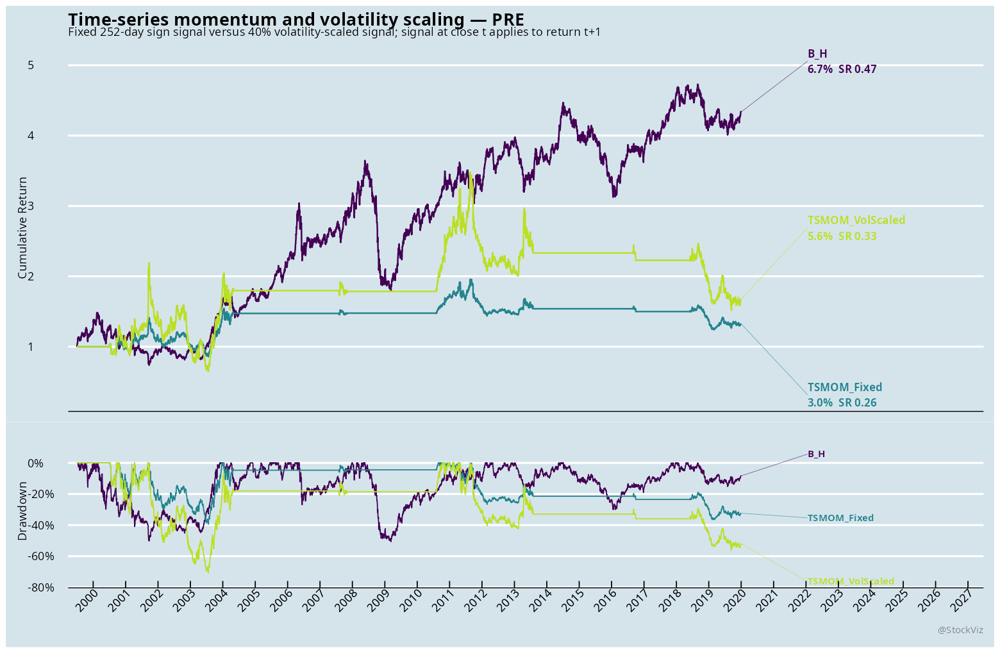
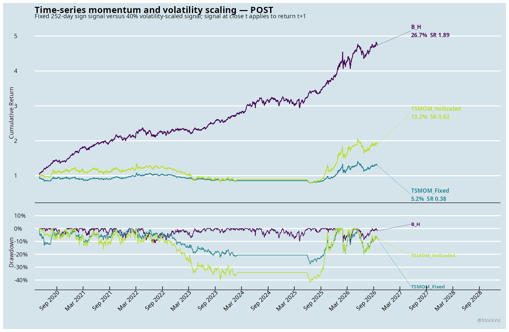
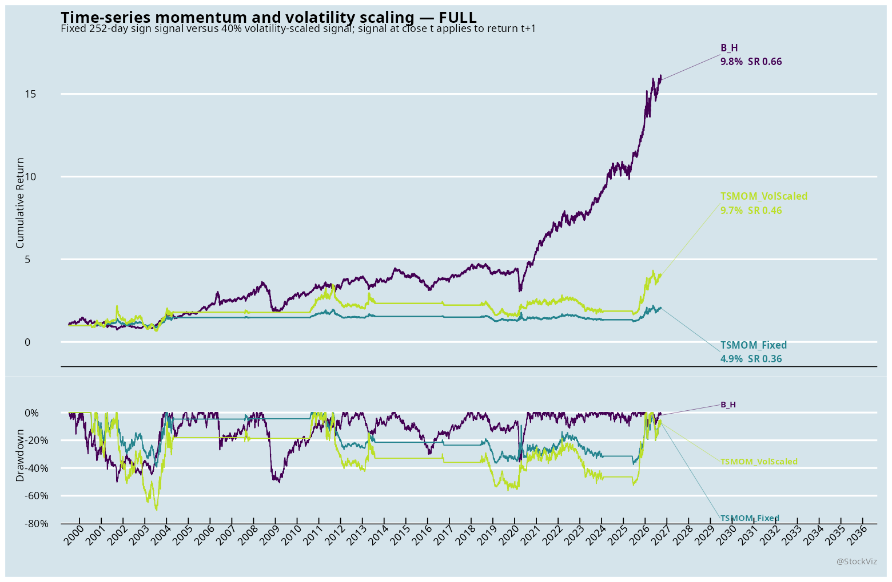

# Time-series momentum and volatility scaling: consolidated findings

Status: executed exploratory adaptation.

Source paper: Moskowitz, Ooi, and Pedersen (2012), `Time Series Momentum`.

## Common implementation

The signal is the sign of each asset's prior 252-observed-day return. Decisions are made at the month-end close and applied to the next trading day's return.

The three systems are:

- `B_H`: equal-weight buy-and-hold across the available panel.
- `TSMOM_Fixed`: the paper's sign signal without volatility scaling.
- `TSMOM_VolScaled`: sign multiplied by `min(3, 40% / trailing 63-day annualized volatility)`.

Costs are charged on average absolute exposure changes: 25 bps for India, 10 bps for US ETF proxies, and 5 bps for crypto. PRE ends on December 31, 2019. POST begins on May 1, 2020. No parameter was selected using POST returns.

The charts and machine-readable artifacts remain in each market folder:

- India: `india/`
- US: `us/`
- Crypto: `crypto/`

Each folder contains daily returns, exposures, signals, audits, checkpoints, metric tables, and cumulative-plus-drawdown charts.

## India

### Data and limitations

The India panel contains NIFTY 50 TR, NIFTY MIDCAP 150 TR, NIFTY MIDCAP SELECT TR, SMALLCAP 250 TR, and GOLD, SILVER, CRUDEOIL, and COPPER MCX series. The sample runs from June 30, 1999 through September 25, 2026, across eight assets and 7,459 dates.

The MCX implementation computes returns within the held expiry and sets the roll-boundary return to zero. It does not book roll P&L, so this is a conservative contract-safe adaptation rather than a final futures replication. The panel has 12,429 missing price cells and 914 zero-return cells; these mostly reflect different asset start dates and the MCX contract construction.

### Metrics

#### PRE: through December 31, 2019

| System | N | CAGR | Vol | Sharpe | MaxDD |
|---|---:|---:|---:|---:|---:|
| B_H | 5,706 | 6.7% | 16.7% | 0.47 | 50.7% |
| TSMOM_Fixed | 2,377 | 3.0% | 16.6% | 0.26 | 39.5% |
| TSMOM_VolScaled | 2,377 | 5.6% | 32.7% | 0.33 | 70.6% |

#### POST: from May 1, 2020

| System | N | CAGR | Vol | Sharpe | MaxDD |
|---|---:|---:|---:|---:|---:|
| B_H | 1,653 | 26.7% | 13.0% | 1.89 | 11.3% |
| TSMOM_Fixed | 1,308 | 5.2% | 17.3% | 0.38 | 27.6% |
| TSMOM_VolScaled | 1,308 | 13.2% | 24.9% | 0.62 | 41.9% |

#### FULL

| System | N | CAGR | Vol | Sharpe | MaxDD |
|---|---:|---:|---:|---:|---:|
| B_H | 7,443 | 9.8% | 16.3% | 0.66 | 50.7% |
| TSMOM_Fixed | 3,769 | 4.9% | 17.7% | 0.36 | 39.5% |
| TSMOM_VolScaled | 3,769 | 9.7% | 30.6% | 0.46 | 70.6% |

### India reading

The fixed signal reduced full-period drawdown relative to B&H but also reduced CAGR and Sharpe. Volatility scaling improved CAGR and Sharpe relative to the fixed signal, but it did not deliver a lower drawdown: the 3x cap and uneven asset histories produced substantially higher full-period risk.

## US

### Data and limitations

The US panel uses SPY, QQQ, IWM, TLT, GLD, and DBC as ETF proxies. This is not a literal replication of the paper's multi-asset futures universe. The sample runs from September 25, 2006 through September 25, 2026, across six assets and 5,033 dates. There are four missing price cells and 166 zero-return cells.

### Metrics

#### PRE: through December 31, 2019

| System | N | CAGR | Vol | Sharpe | MaxDD |
|---|---:|---:|---:|---:|---:|
| B_H | 3,340 | 6.8% | 11.9% | 0.61 | 34.8% |
| TSMOM_Fixed | 3,085 | 3.2% | 12.0% | 0.33 | 27.4% |
| TSMOM_VolScaled | 3,085 | 9.6% | 23.5% | 0.51 | 35.4% |

#### POST: from May 1, 2020

| System | N | CAGR | Vol | Sharpe | MaxDD |
|---|---:|---:|---:|---:|---:|
| B_H | 1,609 | 12.9% | 12.4% | 1.04 | 20.0% |
| TSMOM_Fixed | 1,609 | 6.8% | 10.3% | 0.69 | 14.4% |
| TSMOM_VolScaled | 1,609 | 15.5% | 21.6% | 0.78 | 28.4% |

#### FULL

| System | N | CAGR | Vol | Sharpe | MaxDD |
|---|---:|---:|---:|---:|---:|
| B_H | 5,032 | 8.4% | 12.5% | 0.70 | 34.8% |
| TSMOM_Fixed | 4,777 | 4.6% | 11.4% | 0.45 | 27.4% |
| TSMOM_VolScaled | 4,777 | 12.1% | 22.9% | 0.61 | 35.4% |

### US reading

The fixed signal lowered full-period drawdown but lost return and Sharpe versus B&H. Volatility scaling produced the highest CAGR of the three systems and improved on fixed TSMOM, but its Sharpe remained below B&H and its drawdown was slightly worse than B&H.

## Crypto

### Data and limitations

The crypto panel contains BTCUSDT and ETHUSDT, dailyized from complete UTC days in the validated hourly Binance table. The sample runs from August 18, 2017 through September 25, 2026, across two assets and 3,297 dates. The dailyized panel has no missing price cells or zero-return cells.

This is a daily adaptation of the paper's futures strategy. It is not directly comparable to the original futures sample, and the crypto panel has only two assets.

### Metrics

#### PRE: through December 31, 2019

| System | N | CAGR | Vol | Sharpe | MaxDD |
|---|---:|---:|---:|---:|---:|
| B_H | 851 | 0.3% | 69.7% | 0.36 | 88.0% |
| TSMOM_Fixed | 569 | -44.7% | 61.2% | -0.66 | 84.3% |
| TSMOM_VolScaled | 569 | -30.7% | 41.7% | -0.67 | 73.4% |

#### POST: from May 1, 2020

| System | N | CAGR | Vol | Sharpe | MaxDD |
|---|---:|---:|---:|---:|---:|
| B_H | 2,328 | 32.0% | 52.3% | 0.79 | 76.1% |
| TSMOM_Fixed | 2,328 | 33.2% | 49.0% | 0.83 | 62.8% |
| TSMOM_VolScaled | 2,328 | 28.5% | 38.5% | 0.85 | 51.9% |

#### FULL

| System | N | CAGR | Vol | Sharpe | MaxDD |
|---|---:|---:|---:|---:|---:|
| B_H | 3,296 | 25.1% | 58.6% | 0.68 | 88.0% |
| TSMOM_Fixed | 3,014 | 7.4% | 52.8% | 0.40 | 90.0% |
| TSMOM_VolScaled | 3,014 | 11.8% | 39.8% | 0.48 | 76.6% |

### Crypto reading

The pre-period result is poor for both TSMOM variants. In POST, both TSMOM variants improved on B&H MaxDD, and volatility scaling had the best Sharpe and lowest drawdown, but it gave up CAGR relative to fixed TSMOM. The full-period result remains weaker than B&H on CAGR and Sharpe, although volatility scaling materially reduced drawdown.

## Overall conclusion

This first-pass adaptation does not support one universal winner. The fixed signal is a useful low-complexity baseline, while volatility scaling is most useful as a risk-control overlay in crypto and as a return-enhancing but higher-risk variant in the US panel. In India, the current panel and conservative MCX roll treatment do not show a compelling advantage over B&H.

These results are exploratory. The next India-specific step should be a proper MCX roll-P&L treatment and a panel-level robustness check before drawing a conclusion about time-series momentum in Indian futures.
