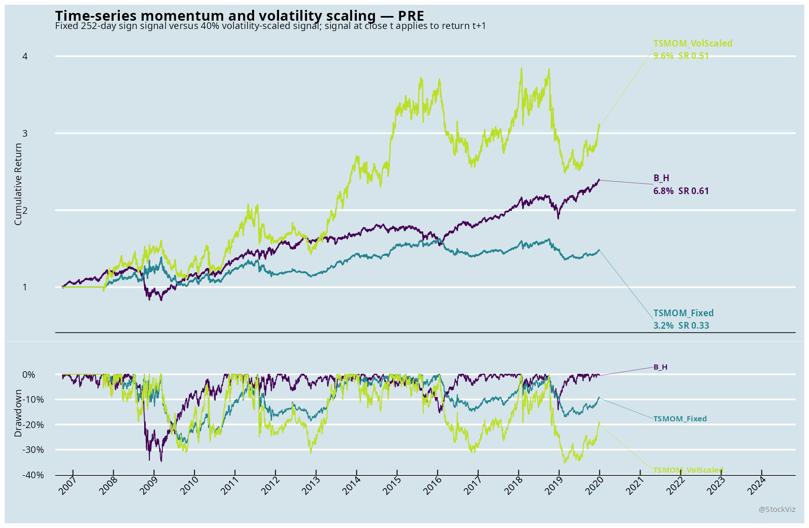
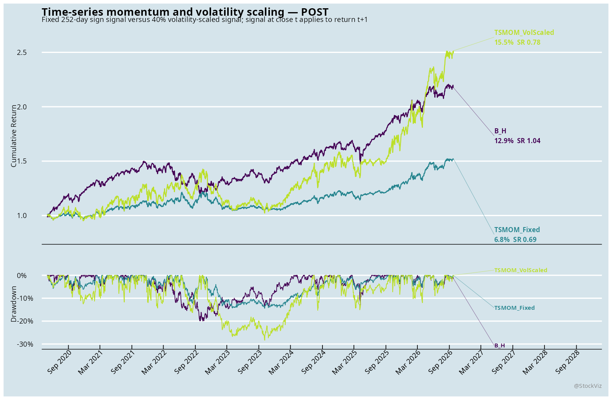
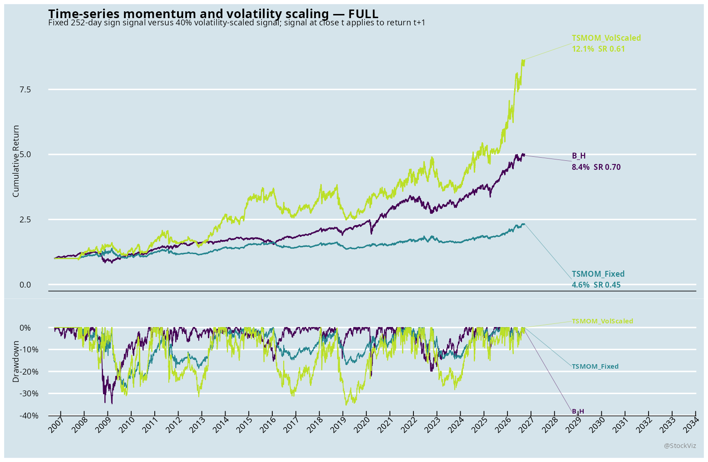

# Time-series momentum and volatility scaling

Status: executed exploratory adaptation.

## Paper mapping

The source paper is Moskowitz, Ooi, and Pedersen (2012), `Time Series Momentum`. The literal signal is the sign of the prior 12-month return, applied to the next holding period. This implementation uses a 252-observed-day signal, monthly close decisions, a one-trading-day causal lag, and a 40% annualized volatility target for the scaled arm.

This report covers: US: ETF proxies for multi-asset futures.
The India arm combines NIFTY total-return indices with MCX contracts. MCX returns are contract-safe within each held expiry; the roll-boundary return is set to zero rather than crossing contracts. The US arm uses ETF proxies because the current US database does not provide the paper's original multi-asset futures panel. The crypto arm dailyizes validated BTCUSDT and ETHUSDT hourly bars into complete UTC days.

## Data audit
- Asset class: US: ETF proxies for multi-asset futures
- Dates: 2006-09-25 to 2026-09-25; 5033 dates; 6 assets.
- Missing price cells: 4; zero-return cells: 166.
- Fixed-signal turnover: 48.67 average-exposure units; volatility-scaled turnover: 152.45.

## Causality and costs

The target exposure is computed from information through the month-end close and shifted one trading day before it earns returns. Costs are charged on average absolute exposure changes: 25 bps for India, 10 bps for US ETFs, and 5 bps for crypto. The 40% target is capped at 3x exposure. No parameter was selected on the named post period.

## Results

The benchmark is equal-weight buy-and-hold across the same available asset panel. The fixed arm uses the paper's sign signal without volatility scaling. The scaled arm targets 40% annualized volatility and is capped at 3x exposure.

### PRE

| System | N | CAGR | Vol | Sharpe | MaxDD |
|---|---:|---:|---:|---:|---:|
| B_H | 3340 | 6.8% | 11.9% | 0.61 | 34.8% |
| TSMOM_Fixed | 3085 | 3.2% | 12.0% | 0.33 | 27.4% |
| TSMOM_VolScaled | 3085 | 9.6% | 23.5% | 0.51 | 35.4% |

### POST

| System | N | CAGR | Vol | Sharpe | MaxDD |
|---|---:|---:|---:|---:|---:|
| B_H | 1609 | 12.9% | 12.4% | 1.04 | 20.0% |
| TSMOM_Fixed | 1609 | 6.8% | 10.3% | 0.69 | 14.4% |
| TSMOM_VolScaled | 1609 | 15.5% | 21.6% | 0.78 | 28.4% |

### FULL

| System | N | CAGR | Vol | Sharpe | MaxDD |
|---|---:|---:|---:|---:|---:|
| B_H | 5032 | 8.4% | 12.5% | 0.70 | 34.8% |
| TSMOM_Fixed | 4777 | 4.6% | 11.4% | 0.45 | 27.4% |
| TSMOM_VolScaled | 4777 | 12.1% | 22.9% | 0.61 | 35.4% |

In each window, read the volatility-scaled arm together with its drawdown and turnover. A higher CAGR or Sharpe is not sufficient if it comes from materially higher leverage or a worse drawdown.

## Limitations

- The India MCX arm omits roll P&L at the contract boundary; its reported returns are deliberately conservative and are not a substitute for a fully marked roll adjustment.
- The US arm is an ETF adaptation, not a futures replication.
- The crypto arm is a daily adaptation of hourly data and is not directly comparable to the original futures sample.
- The paper's CFTC-position analysis is not reproduced because the required point-in-time positioning data is not in this estate.
- This is a first-pass mechanism test, not a deployable strategy or a literal replication.
