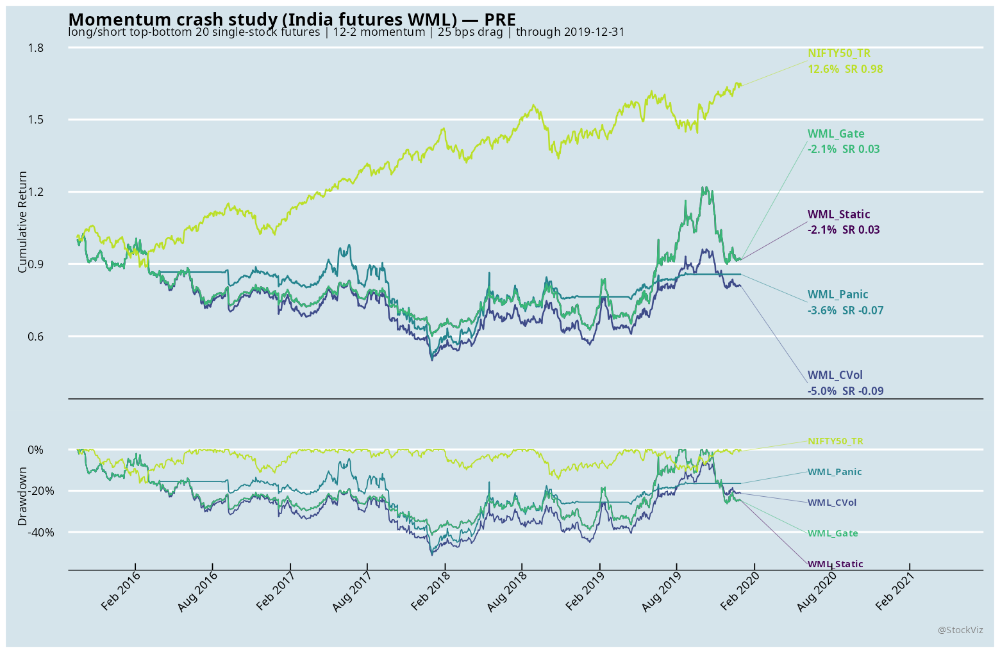
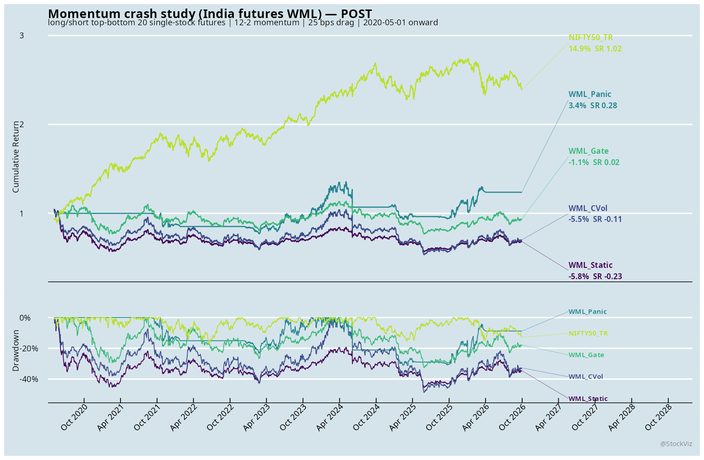
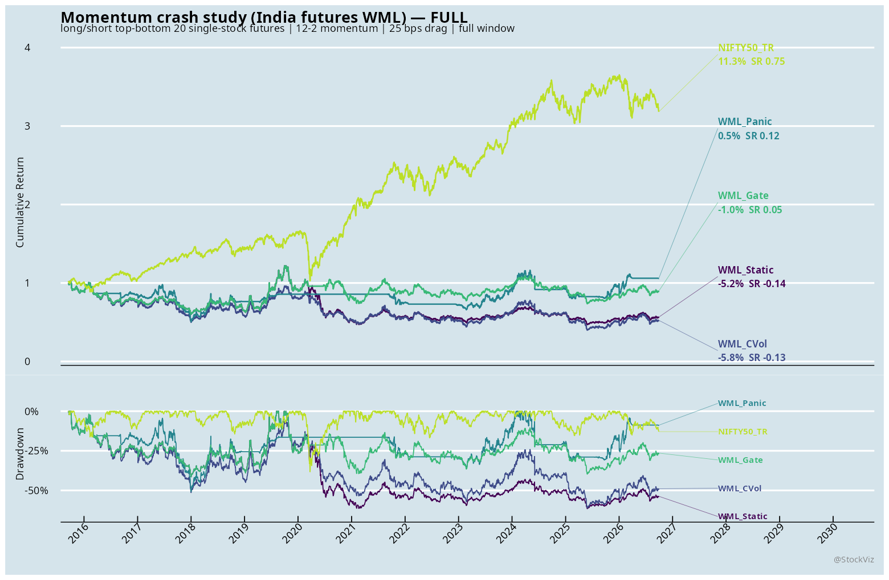

# Momentum crashes: India futures and US large-cap adaptations

Status: executed exploratory backtests, not a replication of Daniel and Moskowitz (2016). The paper's central claim concerns the short-loser leg of a broad cross-sectional momentum book during bear-market rebounds. These two samples test related mechanisms with different instruments and imperfect data. Neither supports a deployable version of the paper's dynamic rule.

## Reading the names and numbers

WML means "winner minus loser." At each decision, the book buys stocks with strong past returns and shorts stocks with weak past returns. Its daily return is the winner leg's return minus the loser leg's return, less trading costs. A rally in the losers hurts WML. India's two legs trade single-stock futures; adjusted cash-equity prices are used only to rank them. The 12-2 signal measures roughly a year's price change but skips the most recent month.

`WML_Static` (India) and `WML` (US) keep the basic long-short book fully exposed. India's `WML_CVol` changes its size to target volatility; `WML_Gate` goes flat when the market is in a two-year bear state with high recent variance. `WML_Panic` sizes the book using a PRE-fitted expected-return/variance rule; because there were too few PRE bear days, its expected-return model uses variance alone. The US `WML_Scaled` combines inverse-volatility sizing with reduced exposure in bear states. In the US detail report, `WML_Long` is the winner basket; `WML_Short` shows the loser basket as if held long, so its positive return is a loss to an actual WML short. `NIFTY50_TR` (NIFTY 50 total return) and SPY are market references, not WML books.

PRE ends December 31, 2019; POST starts May 1, 2020; FULL includes the intervening January-April 2020 period. CAGR is annualized compounded return; Vol is annualized return volatility; Sharpe is annualized return divided by volatility under these reports' convention; MaxDD is the largest peak-to-trough loss. The root tables show MaxDD as a positive loss magnitude (smaller is better); the India detail table shows it as a negative return. AvgExposure is average strategy size, so 0 means flat and 1 means the standard book. Turnover sums absolute changes in portfolio weights over the window, not the number of trades; the strategy metrics include the modeled turnover cost. The state tables use gross WML before costs. A basis point (bp) is 0.01 percentage point; "bp/day" is a daily average, not an annual return.

## Common protocol

Both books use 12-2 winner-minus-loser momentum and close-based decisions that take effect on the next trading day; India rolls five business days before expiry, while the US rebalances monthly. Both charge turnover drag. The bear flag follows the paper's definition: the trailing two-year market return is negative. The market-variance input uses the preceding 126 daily returns. PRE ends December 31, 2019; POST starts May 1, 2020. Overlay choices use PRE only; FULL includes the intervening 2020 crash. A positive MaxDD number below means loss magnitude, while the India market report shows it as a negative drawdown.

The paper ranks broad CRSP deciles and forecasts both conditional mean and GJR-GARCH variance. Here, India ranks equal-weight top/bottom-20 stock futures and uses NIFTY 50 TR for market state; the US ranks equal-weight deciles of historical S&P 500 constituents and uses SPY. Neither uses the original conditional-variance model. Do not compare the two books' levels as if they had the same universe, return adjustment, contract mechanics, or costs.

## India

The first India run was invalid. It ranked stocks from the all-time union of futures symbols, including names that had not yet joined F&O or had already stopped trading, then treated missing contract returns as zero. The corrected run ranks adjusted cash-price 12-2 momentum only among stocks with a quoted next-month single-stock future at that roll close. Both legs earn within-contract futures returns. A daily audit now checks the effective book: PRE averages 20.00 quoted longs and 19.97 quoted shorts; POST averages 20.00 and 19.98. No day is missing more than one name on either side. The producer fails if either leg averages below 95% coverage or loses more than two quotes in a day. See `india/roll_eligibility.csv` and `india/holding_coverage.csv`; the old metrics must not be cited.

The corrected static WML is still weak, but not as poor as the invalid run suggested. It has POST Sharpe -0.23 and MaxDD 45.6%. The fixed bear/high-variance Gate trims POST MaxDD to 32.6% but has a -1.1% CAGR. The variance-only Panic fallback has POST CAGR 3.4% and Sharpe 0.28; it is not the paper's conditional-mean/GJR-GARCH rule. Only 28 PRE days satisfy the two-year bear definition, below the exploratory 63-day guard for fitting the bear-by-variance interaction.

| Window | Static CAGR | Static Sharpe | Static MaxDD | Gate CAGR | Gate Sharpe | Gate MaxDD | Panic Sharpe |
|---|---:|---:|---:|---:|---:|---:|---:|
| PRE | -2.1% | 0.03 | 41.5% | -2.1% | 0.03 | 41.5% | -0.07 |
| POST | -5.8% | -0.23 | 45.6% | -1.1% | 0.02 | 32.6% | 0.28 |
| FULL | -5.2% | -0.14 | 61.5% | -1.0% | 0.05 | 41.5% | 0.12 |

PRE Gate and Static overlap because the panic state does not trigger in that window.

The POST Gate limits the drawdown; the lower-exposure Panic fallback has a small positive return but does not validate the paper's rule. NIFTY 50 TR is context, not an equivalent long-short benchmark.

In the corrected book, bear-up days average -66 bp/day of gross WML versus +2 bp/day on bear-down days. Its within-bear-up market beta is positive, and most of the ten worst days are outside the bear state. These observations are not proof of a written-call short-loser mechanism. The leg and holding audit is in `india/`.

## US

Point-in-time S&P 500 membership avoids applying today's constituent list backward. The stock prices are raw, unadjusted closes; dividends, split adjustment below the 50% daily-move guard, and delisting returns are missing. Missing held-name returns are stale-marked to zero. The book charges 10 bps on each leg's weight turnover and the overlay exposure change. The PRE-selected inverse-volatility/bear gate picks a full shutdown in bear states at the edge of its grid. It improves the static WML's full-sample Sharpe from -0.02 to 0.31 and MaxDD from 84.3% to 48.8%, but POST CAGR remains negative.

| Window | Static CAGR | Static Sharpe | Static MaxDD | Scaled CAGR | Scaled Sharpe | Scaled MaxDD |
|---|---:|---:|---:|---:|---:|---:|
| PRE | -6.6% | -0.15 | 80.7% | 4.9% | 0.35 | 37.9% |
| POST | -3.1% | 0.05 | 53.7% | -0.7% | 0.12 | 43.3% |
| FULL | -4.1% | -0.02 | 84.3% | 4.5% | 0.31 | 48.8% |

The selected overlay improves this sample's PRE metrics; selection on PRE is not independent evidence of an edge.

The holdout improvement is modest, and the price-only scaled CAGR is still below zero. The bottom-decile raw long leg is volatile, but aggregate leg CAGR does not prove that rebounds caused individual crash days.

The full period includes the January–April 2020 gap and is therefore not an untouched holdout. The complete market report, parameter grid, decisions, holdings, and daily exposure are in `us/`.

## Research boundary

The India ex-date exclusion uses only dates known by each decision close, but the adjusted cash series may contain later back-adjustments; point-in-time adjustment provenance is unverified. Its PRE bear interaction is too thin, and the 63-day guard is an exploratory choice, not a validated cutoff. The US source lacks adjusted total-return stock prices and a full-market universe. Neither arm estimates the paper's GJR-GARCH variance, models all financing/shorting constraints, or establishes short-loser call-like exposure from a matched event attribution. These results are useful for screening risk controls, not for trading or for claiming the published result replicated.
