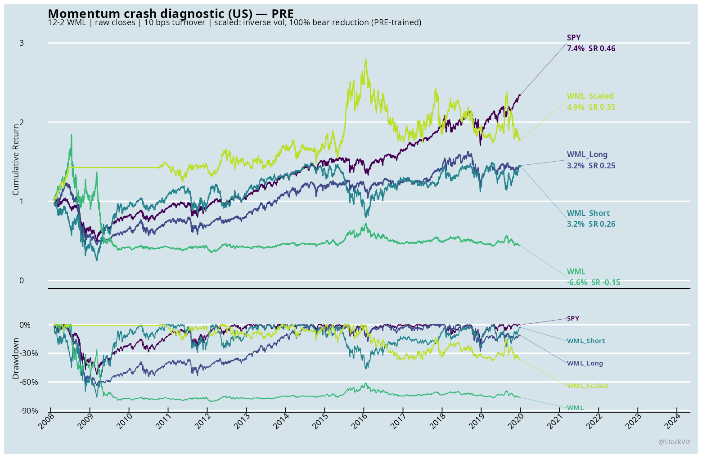
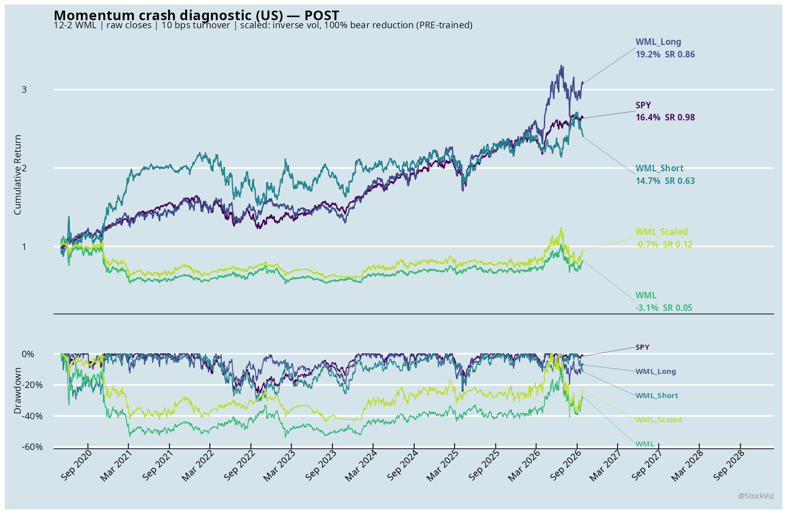
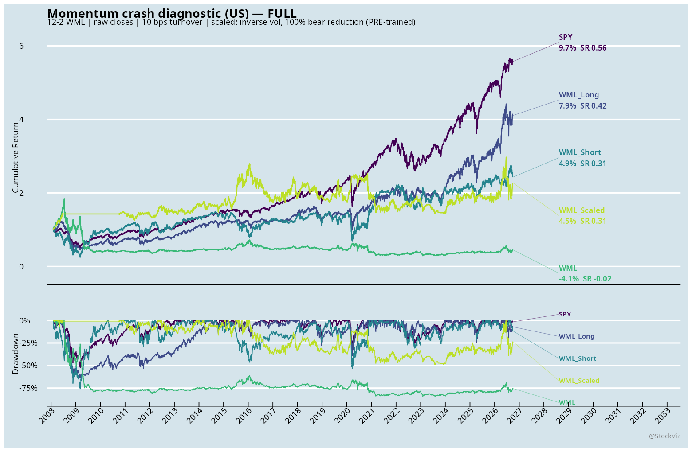

# Momentum crash prediction — US (true long-short diagnostic)

Status: executed.

## Paper mapping

Source paper: Daniel and Moskowitz (2016), *Momentum Crashes*, JFE. The paper's mechanism: winner-minus-loser (12-2) momentum crashes in **panic states** — after deep market declines, at high market volatility, and on sharp rebounds — and the crash is driven by the **short loser leg**, which behaves like a written call on the market.

The paper's two observable conditioning variables (as verified against the primary PDF):
  * **bear indicator**: negative cumulative PAST TWO-YEAR market return (not a running drawdown);
  * **market variance**: variance of the preceding 126 daily market returns.

The paper's dynamic arm forecasts the momentum mean from `bear × variance` and the variance with a GJR-GARCH model. **This study implements a simple pre-trained panic/vol overlay as an explicit adaptation, not that dynamic arm.**

## Implementation

- Universe: historical S&P 500 constituents (`SP500_CONSTITUENTS`, `INDEX_NAME='SPX'`), latest snapshot `PERIOD <= decision date` (point-in-time as-of decision).
- Prices: `StockVizUs2.BHAV_EQ_TD.C` — **raw unadjusted close (price-only)**; there is no adjusted-close column in this table. Dividend reinvestment is absent, and a >50% single-day close move is treated as a corporate action and dropped.
- Signal: 12-2 momentum — cumulative return over months t-12 through t-2 (one-month skip), equal-count deciles; top decile long, bottom decile short, equal weight within each decile.
- Timing: decision at month-end close t, applied from the next trading day (causal). Missing holding-period returns are marked stale (zero), not a delisting model.
- Costs: 10 bps turnover per leg, charged on absolute weight turnover (both legs), plus 10 bps on daily overlay-exposure changes for the scaled arm.
- Windows: PRE ends 2019-12-31; POST begins 2020-05-01; the 2020 gap (Jan–Apr) is excluded from parameter fitting but present in FULL.

## Data audit
- Constituents: 224 snapshots (2008-01-31..2026-08-31), 953 distinct symbols; 792 have price data.
- Prices: 2006-01-03..2026-09-28, 5240 dates, 792 symbols.
- Rebalances: 225 (2008-01-31..2026-09-28). Missing price cells: 824262; zero-return cells: 26578.
- Overlay pre-trained on pre-2020 only: sigma_bar=0.161, panic_p=1.00 (grid 0,0.25,0.5,0.75,1).

## Results

`WML_Short` is the bottom decile shown as a **long** position, so an up-move is the short leg rallying (the crash mechanism). `WML` is long-minus-short. `WML_Scaled` scales the WML book by a pre-trained inverse-vol × panic gate.

### PRE (through 2019-12-31)

| System | N | CAGR | Vol | Sharpe | MaxDD | AvgExposure | Turnover |
|---|---:|---:|---:|---:|---:|---:|---:|
| SPY | 3000 | 7.4% | 19.6% | 0.46 | 52.4% | 1.00 | 0.00 |
| WML_Long | 3000 | 3.2% | 25.4% | 0.25 | 64.1% | 1.00 | 84.84 |
| WML_Short | 3000 | 3.2% | 33.6% | 0.26 | 75.9% | 1.00 | 76.42 |
| WML | 3000 | -6.6% | 25.1% | -0.15 | 80.7% | 1.00 | 161.26 |
| WML_Scaled | 3000 | 4.9% | 19.0% | 0.35 | 37.9% | 1.00 | 189.07 |

### POST (from 2020-05-01)

| System | N | CAGR | Vol | Sharpe | MaxDD | AvgExposure | Turnover |
|---|---:|---:|---:|---:|---:|---:|---:|
| SPY | 1610 | 16.4% | 17.0% | 0.98 | 25.4% | 1.00 | 0.00 |
| WML_Long | 1610 | 19.2% | 23.6% | 0.86 | 24.3% | 1.00 | 42.95 |
| WML_Short | 1610 | 14.7% | 28.0% | 0.63 | 30.8% | 1.00 | 41.33 |
| WML | 1610 | -3.1% | 30.0% | 0.05 | 53.7% | 1.00 | 84.29 |
| WML_Scaled | 1610 | -0.7% | 28.5% | 0.12 | 43.3% | 0.95 | 125.80 |

### FULL

| System | N | CAGR | Vol | Sharpe | MaxDD | AvgExposure | Turnover |
|---|---:|---:|---:|---:|---:|---:|---:|
| SPY | 4693 | 9.7% | 19.8% | 0.56 | 52.4% | 1.00 | 0.00 |
| WML_Long | 4693 | 7.9% | 25.8% | 0.42 | 64.1% | 1.00 | 130.35 |
| WML_Short | 4693 | 4.9% | 32.9% | 0.31 | 75.9% | 1.00 | 119.71 |
| WML | 4693 | -4.1% | 27.0% | -0.02 | 84.3% | 1.00 | 250.06 |
| WML_Scaled | 4693 | 4.5% | 22.7% | 0.31 | 48.8% | 0.98 | 322.29 |

## Reading

Static 12-2 WML is weak over this S&P 500 sample. The original paper uses a broader CRSP universe, so the results are not directly comparable. The bottom-decile long leg is more volatile than the winner leg. Its positive POST CAGR does not, by itself, establish that loser rebounds caused particular WML crash episodes; that requires event-level attribution.

The PRE-selected overlay improves full-sample Sharpe from -0.02 to 0.31 and MaxDD from 84.3% to 48.8%; POST Sharpe is only 0.12 and POST CAGR remains negative. The selected panic reduction is at the edge of the grid (panic_p = 1.0, full shutdown in bear states). This boundary choice is not evidence of a stable optimum, and both US arms remain price-only approximations.

## Limitations

- S&P 500 only (no small caps): the momentum premium itself is largely absent, so absolute WML performance is not comparable to the paper's full cross-section.
- Price-only closes (no dividend reinvestment, no corporate-action adjustment beyond the >50% daily-move guard).
- The panic overlay is a **simple adaptation**: it uses the bear indicator and realized variance only, and does not forecast the mean from `bear × variance` nor model variance with GJR-GARCH, and does not separately time the rebound. It is not equivalent to the paper's dynamic arm.
- panic_p is selected in-sample on pre-2020; POST is the honest out-of-sample window.
- Missing holding-period returns are marked to zero (stale-mark convention), not modeled as delisting returns.
